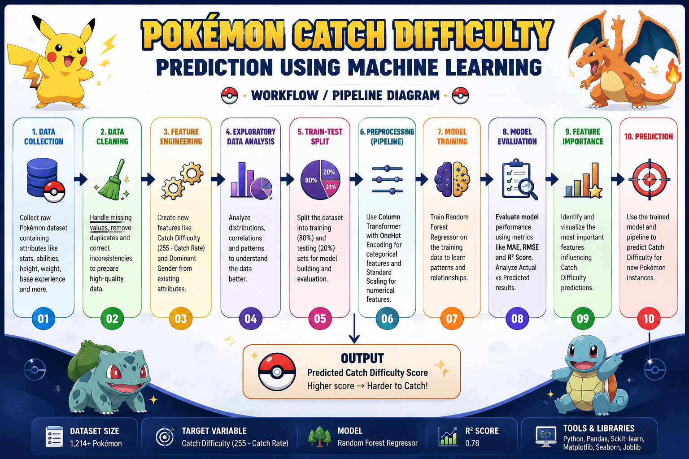
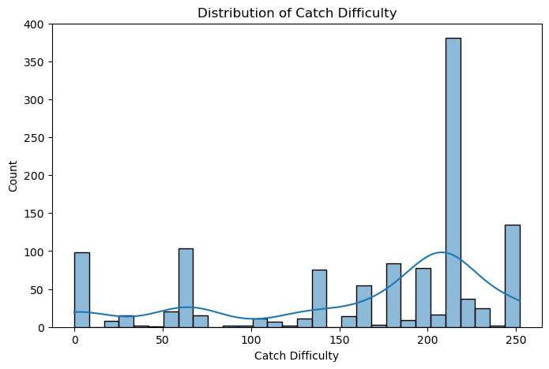
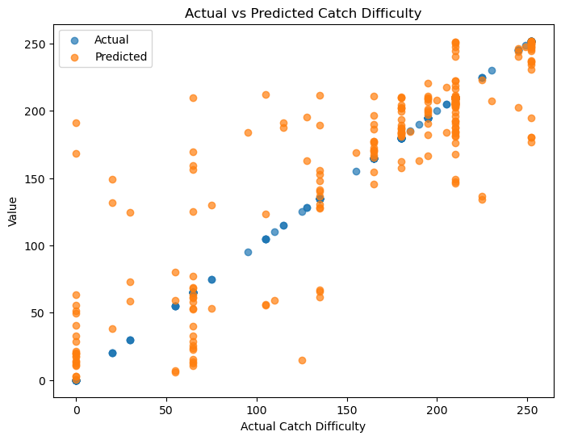
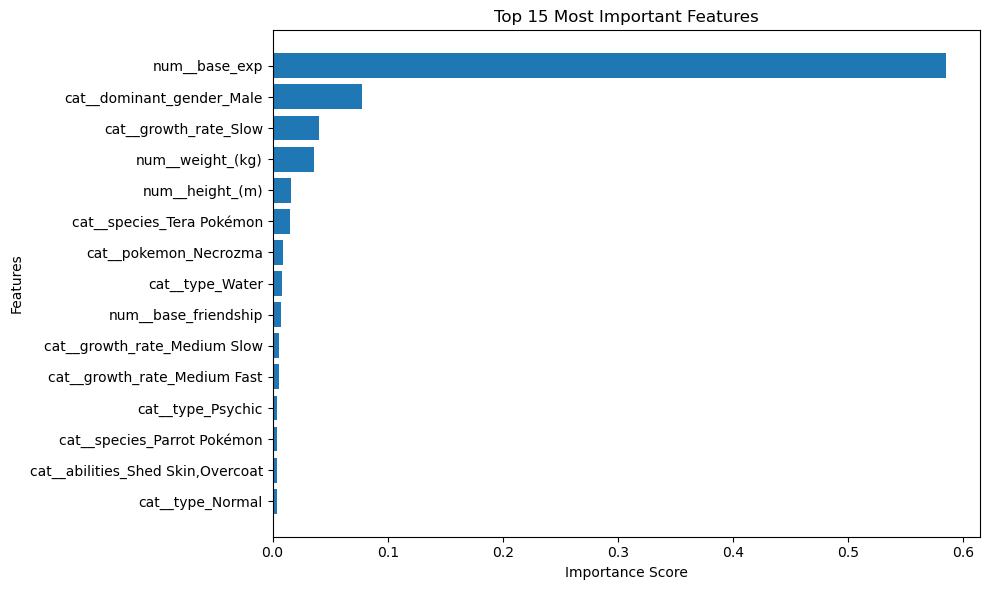

# ⚡ Pokémon Catch Difficulty Prediction using Machine Learning


## 📌 Project Overview

This project develops an end-to-end Machine Learning solution to predict the **Catch Difficulty** of Pokémon using their biological, physical, and gameplay-related characteristics.

The project demonstrates the complete machine learning workflow, including:

- Data Cleaning
- Feature Engineering
- Exploratory Data Analysis (EDA)
- Feature Encoding
- Feature Scaling
- Pipeline Construction
- Model Training
- Model Evaluation
- Feature Importance Analysis

A **Random Forest Regressor** was trained to predict Pokémon Catch Difficulty and achieved strong predictive performance on unseen data.

---

## 🎯 Problem Statement

In Pokémon games, each Pokémon has a Catch Rate that determines how easy or difficult it is to capture.

The objective of this project is to predict a Pokémon's **Catch Difficulty** using various Pokémon characteristics such as:

- Type
- Species
- Physical Attributes
- Abilities
- Growth Rate
- Base Friendship
- Base Experience
- Gender Distribution

This transforms a gaming dataset into a practical Machine Learning regression problem.

---

## 🔄 Machine Learning Workflow



The project follows a structured Machine Learning workflow:

```text
Raw Dataset
    ↓
Data Cleaning
    ↓
Feature Engineering
    ↓
Train-Test Split
    ↓
ColumnTransformer
    ↓
One-Hot Encoding
    ↓
Feature Scaling
    ↓
Random Forest Regressor
    ↓
Catch Difficulty Prediction
```

This workflow ensures consistency, reproducibility, and prevention of data leakage.

---

## 📊 Dataset Information

### Dataset Size

- Total Records: **1,214+ Pokémon**

### Numerical Features

- Height (m)
- Weight (kg)
- Base Friendship
- Base Experience

### Categorical Features

- Pokémon Name
- Type
- Species
- Abilities
- Growth Rate
- Dominant Gender

### Target Variable

- Catch Difficulty

---

## 🛠 Feature Engineering

To improve predictive performance and interpretability, new features were engineered from existing attributes.

### Catch Difficulty

Created from the original Catch Rate using:

```text
Catch Difficulty = 255 − Catch Rate
```

Interpretation:

- Higher Value → Harder to Catch
- Lower Value → Easier to Catch

---

### Dominant Gender

Created from Male % and Female % distributions.

Possible Categories:

- Male
- Female
- Balanced

This feature simplifies gender information into a more meaningful representation for the model.

---

## 🔍 Exploratory Data Analysis

Exploratory analysis was conducted to understand the dataset distribution and identify relationships among features.

### Catch Difficulty Distribution



This visualization illustrates how Pokémon are distributed across different levels of catch difficulty.

---

## ⚙️ Data Preprocessing

### Categorical Features

Categorical variables were transformed using:

- One-Hot Encoding

### Numerical Features

Numerical variables were standardized using:

- StandardScaler

Both transformations were integrated into a single **ColumnTransformer** for efficient preprocessing.

---

## 🤖 Machine Learning Pipeline

A Scikit-Learn Pipeline was implemented to automate the complete workflow:

- Data Transformation
- Feature Encoding
- Feature Scaling
- Model Training
- Prediction

### Benefits

- Eliminates repetitive preprocessing code
- Prevents data leakage
- Improves reproducibility
- Simplifies deployment

---

## 🌲 Model Selection

### Random Forest Regressor

Random Forest was selected because it:

- Handles mixed data types effectively
- Captures non-linear relationships
- Reduces overfitting through ensemble learning
- Provides feature importance analysis
- Delivers strong performance with minimal tuning

---

## 📈 Model Performance

### Evaluation Metrics

| Metric | Score |
|----------|----------|
| MAE | 24.33 |
| MSE | 1529.30 |
| RMSE | 39.11 |
| R² Score | **0.7453** |

### Interpretation

The Random Forest Regressor achieved an **R² score of 0.7453**, indicating that the model explains approximately **74.5% of the variance** in Pokémon Catch Difficulty.

The results demonstrate a strong relationship between the selected features and the target variable while maintaining good generalization on unseen data.

---

## 🎯 Actual vs Predicted Performance

The following visualization compares actual Catch Difficulty values with model predictions.



### Key Observation

Most predictions closely follow the ideal prediction line, indicating that the model performs well across a wide range of Pokémon.

---

## ⭐ Feature Importance Analysis

Feature importance analysis was performed using the Random Forest model to identify the most influential predictors.



### Key Findings

| Feature | Importance |
|----------|----------:|
| Base Experience | 58.5% |
| Dominant Gender | 7.8% |
| Growth Rate (Slow) | 4.1% |
| Weight | 3.6% |
| Height | 1.6% |

### Insights

- Base Experience emerged as the strongest predictor of Catch Difficulty.
- The engineered Dominant Gender feature ranked among the most influential variables.
- Growth Rate contributed meaningful predictive information.
- Physical attributes such as Height and Weight also influenced model predictions.
- Species-specific characteristics played a role in determining catch difficulty.

---

## 📌 Key Results

- Dataset Size: **1,214+ Pokémon**
- Custom Feature Engineering Implemented
- End-to-End Scikit-Learn Pipeline
- Random Forest Regression Model
- R² Score: **0.7453**
- Feature Importance Analysis Performed
- Automated Preprocessing Workflow

---

## 💡 Skills Demonstrated

This project showcases practical experience in:

- Data Cleaning
- Feature Engineering
- Exploratory Data Analysis
- Regression Modeling
- Feature Encoding
- Feature Scaling
- ColumnTransformer
- Scikit-Learn Pipelines
- Random Forest Regression
- Model Evaluation
- Model Interpretation

---

## 🚀 Future Improvements

Potential enhancements include:

- Hyperparameter Optimization
- Cross Validation
- XGBoost Implementation
- LightGBM Implementation
- Streamlit Deployment
- Model Comparison Framework
- Automated Prediction Dashboard

---

## 🧰 Technologies Used

- Python
- Pandas
- NumPy
- Matplotlib
- Seaborn
- Scikit-Learn
- Joblib

---

## 📂 Project Structure

```text
Pokemon-Catch-Difficulty-Prediction/
│
├── data/
│   ├── pokemonDB_raw_dataset.csv
│   └── cleaned_pokemon_dataset.csv
│
├── notebooks/
│   └── Pokemon_Catch_Difficulty_Prediction.ipynb
│
├── images/
│   ├── pokemon_banner.png
│   ├── pipeline_workflow.png
│   ├── catch_difficulty_distribution.png
│   ├── actual_vs_predicted.png
│   └── feature_importance.png
│
│
├── models/
│   └── pokemon_catch_difficulty_model.pkl
│
├── README.md
├── requirements.txt
└── .gitignore
```

---

## 🏆 Conclusion

This project successfully developed an end-to-end Machine Learning pipeline capable of predicting Pokémon Catch Difficulty using biological, physical, and gameplay-related attributes.

Through feature engineering, preprocessing automation, model training, evaluation, and interpretability analysis, the project demonstrates a complete Machine Learning workflow and provides a reproducible framework for future predictive modeling tasks.